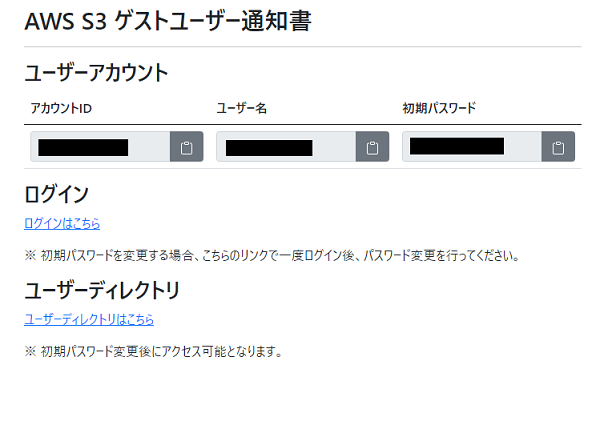
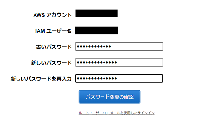

# 1. AWS 初期パスワード変更手順
AWSユーザーの初期パスワード変更手順を記載します。

## 1.1. AWS S3 ゲストユーザー通知書の確認
1. 管理者より通知された、**<ユーザー名>_credentials.html** ファイルをブラウザ等で開きます。

2. **アカウントID**, **ユーザー名**, **初期パスワード**を確認してください。

## 1.2. 初期パスワードを使用してログイン
1. **AWS S3 ゲストユーザー通知書**の**ログインはこちら**をクリックします。

2. 以下のIAMユーザーサインイン画面が表示されます。**AWS S3 ゲストユーザー通知書**に記載されたアカウントID、ユーザー名、初期パスワードを使用し、**サインイン**します。

## 1.3. パスワード変更
1. サインインが正常に完了すると、自動的に以下のパスワード変更画面に遷移します。**古いパスワード**に初期パスワード、**新しいパスワード/新しいパスワードを再入力**にユーザーが設定するパスワード入力し、**パスワード変更の確認**をクリックします。

2. パスワード変更が正常に完了すると、AWSのダッシュボード画面が表示されます。

> ※ パスワードは以下のポリシーにしたがって設定してください。
> - パスワードの最小文字数は 12 文字です
> - 1 文字以上のアルファベット大文字 (A～Z) を必要とする
> - 1 文字以上のアルファベット小文字 (a～z) を必要とする
> - 少なくとも 1 つの数字が必要
> - 少なくとも 1 つの英数字以外の文字が必要 (! @ # $ % ^ & * ( ) _ + - = [ ] { } | ')>

## 2. その他
セキュリティ上の理由により、変更後のパスワードテキストはAWSから確認不可能となります。パスワードを忘れた場合はパスワードの初期化/再設定が必要となります。ご了承ください。

(参考)[AWSユーザーズガイド IAMユーザーのパスワードの管理](https://docs.aws.amazon.com/ja_jp/IAM/latest/UserGuide/id_credentials_passwords_admin-change-user.html)

また、IAMユーザーの詳細情報については、以下AWSの公式ドキュメントを確認するか、管理者に問い合わせてください。

[AWSユーザーズガイド IAMユーザー](https://docs.aws.amazon.com/ja_jp/IAM/latest/UserGuide/id_users.html)
